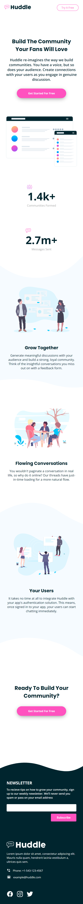
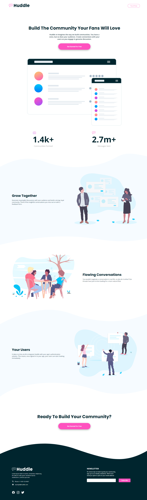

# Sobre o Projeto
Projeto clone do desafio [FrontEnd Mentor](https://www.frontendmentor.io/challenges/huddle-landing-page-with-curved-sections-5ca5ecd01e82137ec91a50f2), aplicado SCSS juntamente com a metodologia BEM (convenção de nomenclatura de classe css) para ajudar na organização do estilo da página e facilitar na manutenção.

### Desing Mobile

### Design Desktop

# Tecnologias utilizadas
* HTML
* SCSS
* JS

### Observação
* Utilizado Extensão do VSCODE Live SASS Compiler para gerar o CSS estatico (main.css)
